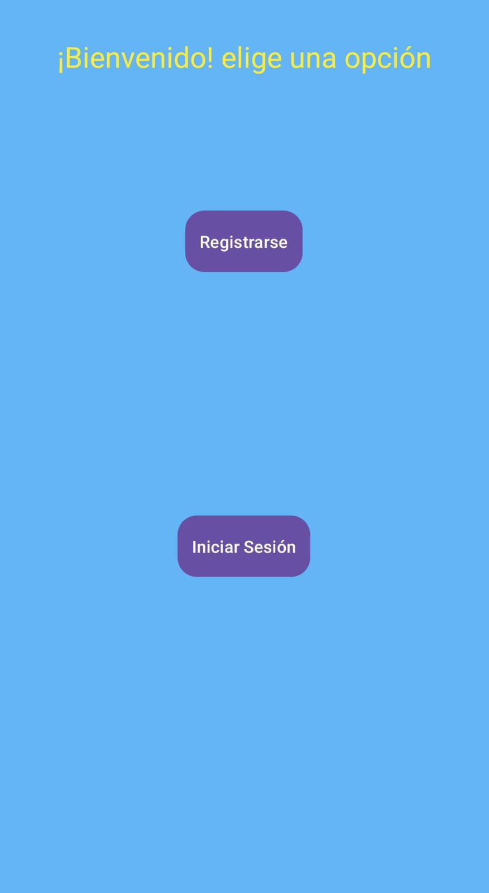
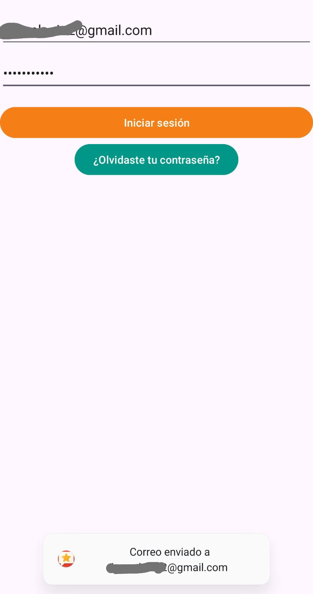
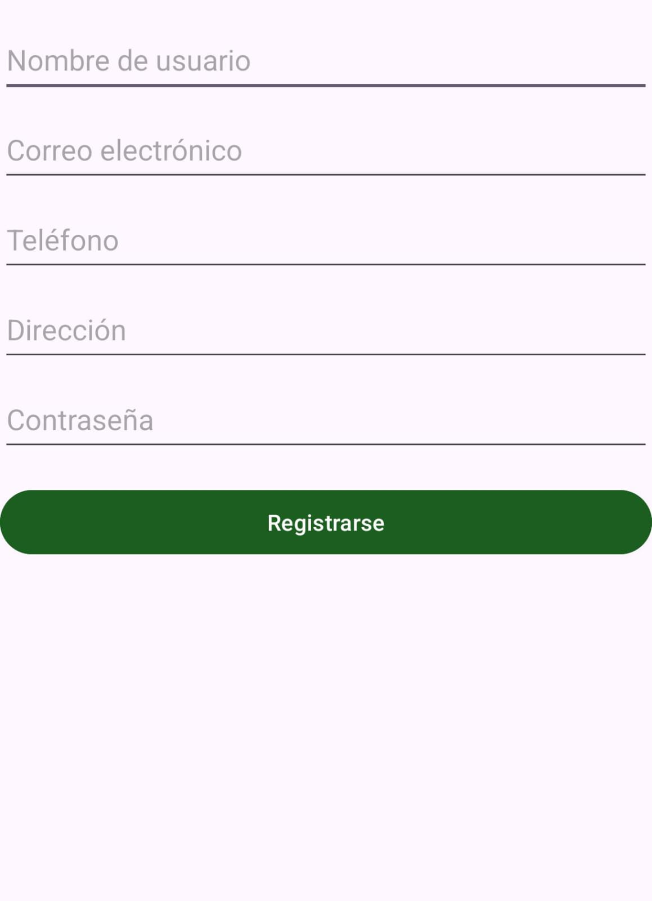
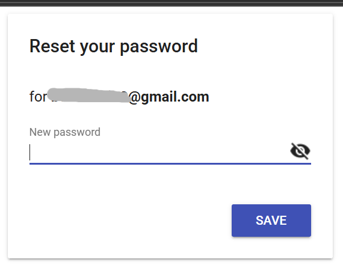
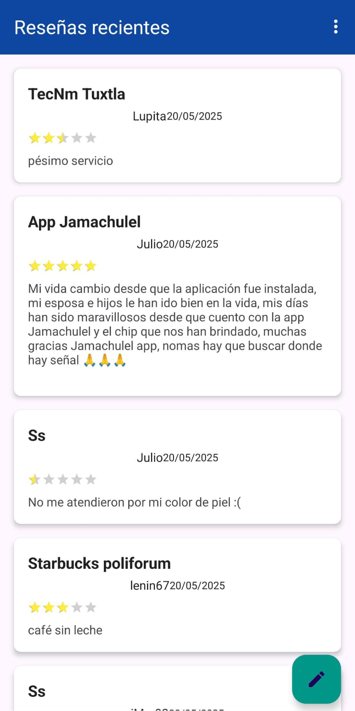
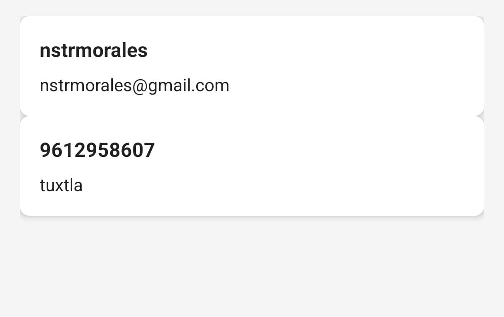
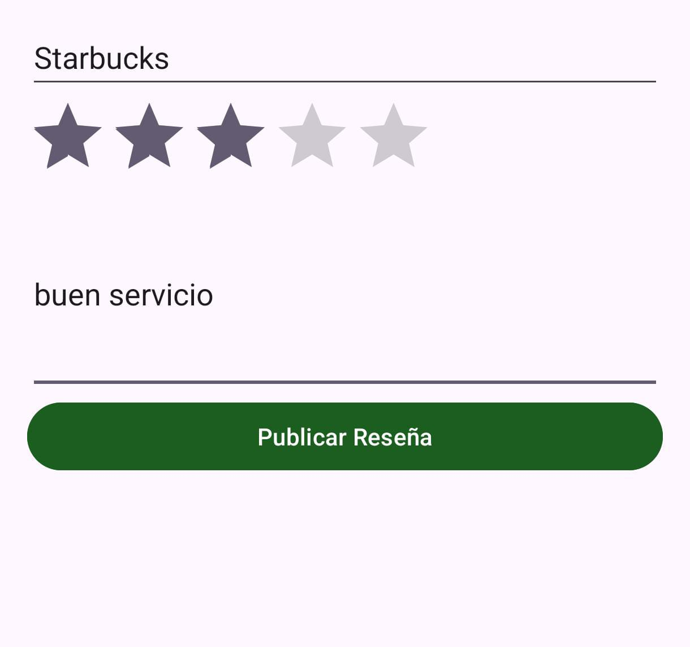

# Maket Android - Sistema de Reseñas Colaborativo

**Maket Android** es una aplicación móvil diseñada para permitir a los usuarios compartir y descubrir reseñas de diversos lugares. Construida con **Java** y potenciada por **Firebase**, ofrece una experiencia fluida, segura y en tiempo real para la gestión de opiniones y perfiles de usuario.

---

## Características Principales

*   **Autenticación Segura:** Sistema de registro e inicio de sesión gestionado por **Firebase Auth**, con validación obligatoria de correo electrónico para garantizar una comunidad auténtica.
*   **Catálogo en Tiempo Real:** Visualización instantánea de reseñas publicadas por otros usuarios mediante **Firestore Snapshot Listeners**.
*   **Gestión de Reseñas:** Los usuarios pueden publicar reseñas detallando el lugar, una calificación mediante estrellas (`RatingBar`) y comentarios personalizados.
*   **Perfiles de Usuario:** Cada usuario cuenta con un perfil detallado que almacena información como nombre de usuario, correo, teléfono y dirección, sincronizado globalmente.
*   **Interfaz Moderna:** Uso de componentes de **Material Design**, incluyendo `FloatingActionButton`, `RecyclerView` y `Snackbars` para una navegación intuitiva.
*   **Seguridad de Datos:** Las reglas de negocio impiden que usuarios no verificados publiquen contenido, manteniendo la integridad del sistema.

---

## Estructura Detallada del Proyecto

A continuación, se detalla la organización del código fuente y la responsabilidad de cada componente principal:

### 1. Capa de Lógica y Controladores (`java/com/example/apiconecta1/`)
- **`MainActivity.java`**: Actúa como el *Gateway* de la aplicación. Verifica el estado de la sesión activa y redirige al catálogo si el usuario ya está autenticado.
- **`CatalogoResenasActivity.java`**: El núcleo de la aplicación. Gestiona la lógica de consulta a Firestore, filtrando las reseñas para mostrar las de otros usuarios y escuchando cambios en la base de datos (añadidos o eliminaciones).
- **`NuevaResenaActivity.java`**: Controlador del formulario de creación. Gestiona la captura de datos (Rating, Texto, Lugar) y su persistencia en la colección `resenas` de Firestore con timestamps del servidor.
- **`ProfileActivity.java`**: Gestiona la recuperación asíncrona de datos desde la colección `users`, permitiendo al usuario visualizar su información de cuenta.
- **`ResenaAdapter.java`**: Implementa el patrón *ViewHolder*. Es el puente entre los datos de Firestore y la interfaz de usuario, optimizando el uso de memoria en el scroll.
- **`Resena.java`**: Clase POJO (Plain Old Java Object) que define la estructura de una reseña, diseñada para ser serializada automáticamente por Firestore.

### 2. Capa de Recursos y UI (`res/`)
- **`layout/`**: Contiene los diseños XML de las actividades (`activity_*.xml`) y el diseño de las tarjetas individuales para las reseñas (`item_resena.xml`).
- **`menu/`**: Define las opciones de navegación rápida (Perfil y Cerrar Sesión) en el Toolbar superior.
- **`drawable/`**: Incluye recursos visuales como `rounded_button.xml` para una estética moderna y consistente.

---

## Stack Tecnológico

| Tecnología | Uso |
| :--- | :--- |
| **Java 11** | Lenguaje de programación principal. |
| **Firebase Firestore** | Base de datos NoSQL documental en tiempo real. |
| **Firebase Auth** | Gestión de identidades y seguridad de acceso. |
| **Picasso** | Gestión eficiente de imágenes y caché. |
| **Material Design** | Guías de diseño para componentes de UI. |

---

## Configuración e Instalación

Para ejecutar este proyecto localmente, sigue estos pasos:

1.  **Clonar el repositorio:**
    ```bash
    git clone https://github.com/tu-usuario/maket-android.git
    ```
2.  **Configurar Firebase:**
    *   Crea un proyecto en [Firebase Console](https://console.firebase.google.com/).
    *   Añade una aplicación Android con el paquete `com.example.apiconecta1`.
    *   Descarga el archivo `google-services.json` y colócalo en la carpeta `app/`.
    *   Habilita **Authentication** (Correo/Contraseña) y **Firestore Database**.
3.  **Compilar y Ejecutar:**
    *   Abre el proyecto en **Android Studio**.
    *   Sincroniza los archivos Gradle.
    *   Ejecuta la aplicación en un emulador o dispositivo físico.

---

## Vista Previa

> **Capturas de pantalla de algunas de las interfaces de la app:**
> 1. Pantalla de inicio.
>
> 2. Pantalla de Login (Opcion para restablecer contraseña).
>
> 3. Pantalla de Registro.
>
> 4. Restablecer contraseña (en la web).
>
> 5. Catálogo de Reseñas (RecyclerView).
>
> 6. Detalles de cuenta.
>
> 7. Formulario de Nueva Reseña.
>

---
**Desarrollado por:** [Tu Nombre / Alber Knight]
*Proyecto de ejemplo para la gestión de APIs y conectividad móvil.*
